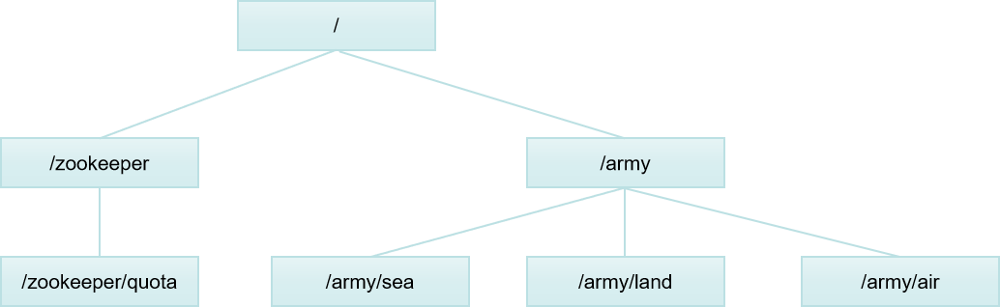
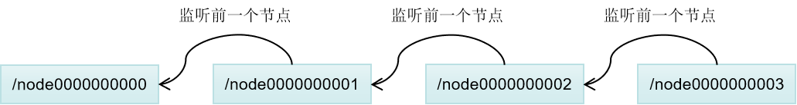
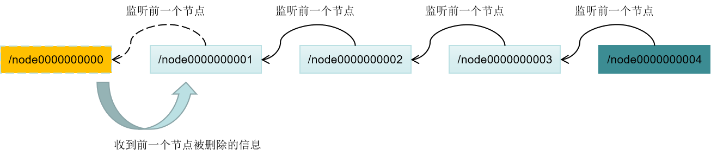
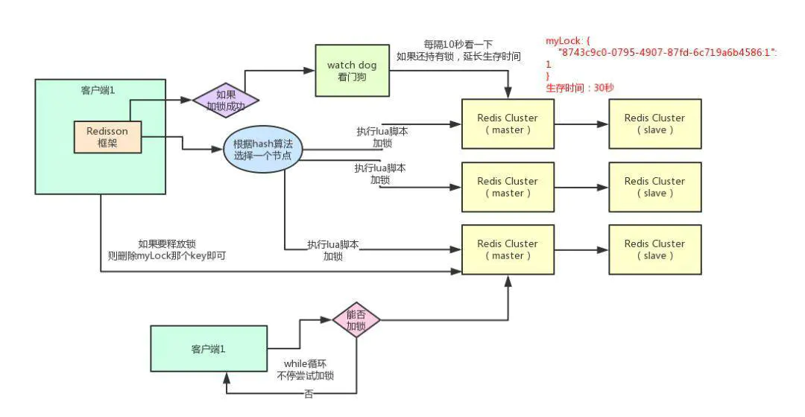

# 分布式锁

### 1. 分布式锁概述

#### 1.1 锁的本质与分类

本质：	

​	同一时间，对指定的对象，只允许一个操作。

分类：

- 线程锁：

  ​	主要是用来给**方法**或者**代码块**加锁的。当某个方法或代码使用锁时，在同一时间只能有一个线程执行该方法或者该代码段。线程锁的实现其实是依靠线程之间**共享的内存**来实现的，因此线程锁只是针对同一个 JVM中才有效。

- 进程锁：

  ​	主要是为了控制同一系统中某个资源同时被多个进程访问。而每个进程都是独立的，因此各个进程是无法互相访问彼此的资源的，也无法像线程那样通过 synchronized 来实现进程锁。

- 分布式锁：

  ​	控制分布式系统间同步请求共享资源的一种方式。在分布式系统中，如果不同的系统或是同一个系统的不同主机之间共享同一资源，那么访问这个资源的时候，需要互斥来防止彼此干扰来保证一致性，在这种情况下，便需要使用到分布式锁。
  
  

#### 1.2 分布式锁的要求

- a. 排他性：在分布式高并发的条件下，同一时刻只能有一个线程获得锁。

- b. 避免死锁：在客户端使用锁过程中出现异常也不应该出现死锁，应该及时释放锁确保后续流程正常运行。

- c. 一致性：加锁和解锁应当是同一个客户端，自己加锁自己解锁，不能去操作其它锁。

- d. 容错性：分布式锁服务一般要满足 AP，也就是说，只要分布式锁服务集群节点大部分存活，client 就可以进行加锁解锁操作。

- e. 重入: 同一个线程可以重复拿到同一个资源的锁。重入锁非常有利于资源的高效利用。

- f. 性能：对于访问量大的共享资源，需要考虑减少锁等待的时间，避免导致大量线程阻塞。

  - 锁的颗粒度要尽量小
  
- 锁的范围尽量要小
  
    
  

#### 1.3 CAP之间的取舍

​	CAP 原则又称 CAP 定理, 指的是在一个分布式系统中,  Consistency（一致性）、 Availability（可用性）、Partition tolerance（分区容错性）, **三者不可得兼**

- **一致性(C) :** 在分布式系统中的所有数据备份, 在同一时刻是否同样的值(等同于所有节点访问同一份最新的数据副本)
- **可用性(A):** 在集群中一部分节点故障后, 集群整体是否还能响应客户端的读写请求(对数据更新具备高可用性)
- **分区容忍性(P):** 以实际效果而言, 分区相当于对通信的时限要求. 系统如果不能在时限内达成数据一致性, 就意味着发生了分区的情况, 必须就当前操作在 C 和 A 之间做出选择


#### 1.4 常见的实现方式

- a. 基于数据库实现
  - 乐观锁，基于version
  - 悲观锁，基于数据库级别的`for update`关键字
- b. 基于Zookeeper实现
  - 使用临时有序节点  `create -e -s /lock/seq/ data`
- c. 基于Redis实现
  - jedis，基于setnx,expire
  - redission


### 2. 基于数据库实现

####  2.1 一个简单的实现

​	创建一张锁表，然后通过操作该表中的数据来实现。当我们想要获得锁的时候，就可以在该表中增加一条记录，想要释放锁的时候就删除这条记录。

*例：*

​	创建用于锁的表lock：

```sql
CREATE TABLE `database_lock` (
	`id` BIGINT NOT NULL AUTO_INCREMENT,
	`resource` int NOT NULL COMMENT '锁定的资源',
	PRIMARY KEY (`id`),
	UNIQUE KEY `uiq_idx_resource` (`resource`) 
) ENGINE=InnoDB DEFAULT CHARSET=utf8mb4 COMMENT='数据库分布式锁表';
```

​	**上锁**，可以插入一条数据。如果有多个请求同时提交到数据库的话，数据库可以保证只有一个操作可以成功，其它的会报错。我们就可以认为操作成功的那个请求获得了锁。

```sql
INSERT INTO database_lock(resource, description) VALUES (1, 'lock');
```

​	**解锁**，可以删除这条数据：

```sql
DELETE FROM database_lock WHERE resource=1;
```

​	

#### 2.2 乐观锁

​	系统认为数据的更新在大多数情况下是不会产生冲突的，只在数据库更新操作提交的时候才对数据作冲突检测。如果检测的结果出现了与预期数据不一致的情况，则返回失败信息

​	基于version实现，即为数据增加一个版本标识，在基于数据库表的版本解决方案中，一般是通过为数据库表添加一个 “version”字段来实现读取出数据时，将此版本号一同读出，之后更新时，对此版本号加1。在更新过程中，会对版本号进行比较，如果是一致的，没有发生改变，则会成功执行本次操作；如果版本号不一致，则会更新失败。

*例*

​	创建用于乐观锁的表，并预置数据：

```sql
CREATE TABLE `optimistic_lock` (
	`id` BIGINT NOT NULL AUTO_INCREMENT,
	`resource` int NOT NULL COMMENT '锁定的资源',
	`version` int NOT NULL COMMENT '版本信息',
	PRIMARY KEY (`id`),
	UNIQUE KEY `uiq_idx_resource` (`resource`) 
) ENGINE=InnoDB DEFAULT CHARSET=utf8mb4 COMMENT='数据库分布式锁表';

# 一般在使用乐观锁会确保表中有相应的数据
INSERT INTO optimistic_lock(resource, version) VALUES('lock', 1);
```

​	step1:  获取资源

```sql
SELECT resource, version FROM optimistic_lock WHERE resource = 'lock';
```

​	step2：执行业务逻辑，记录此时的版本 version=oldVersion

​	step3:   执行更新操作。如果改记录更新成功，则认为业务正常；否则表示在此其它，有其它线程获得过该把锁，需要，step2中的业务执行无效，需要从step1再次尝试。

```sql
UPDATE optimistic_lock SET resource = 'lock', version = version + 1 WHERE id = 1 AND version = oldVersion
```


#### 2.3 悲观锁

​	与乐观锁相反，总是假设最坏的情况，它认为数据的更新在大多数情况下是会产生冲突的。

​	基于数据库级别的`for update`关键字。即在查询语句后面增加FOR UPDATE，数据库会在查询过程中给数据库表增加悲观锁，也称排他锁。当某条记录被加上悲观锁之后，其它线程也就无法再改行上增加悲观锁。

*例*

​	step0：在使用悲观锁时，我们必须关闭数据库的自动提交属性

```sql
SET AUTOCOMMIT = 0;
```

​	step1: 明确地指定主键，获取锁

```sql
SELECT * FROM database_lock WHERE id = 1 FOR UPDATE;
```

​	step2: 执行业务逻辑

​	step3：释放锁

```
commit;
```

如果线程B在线程A释放锁之前执行step1,那么它会被阻塞，直至线程A释放锁之后才能继续。如果线程A长时间未释放锁，那么线程B会报错，参考如下（lock wait time可以通过innodb_lock_wait_timeout来进行配置）：


参考：[基于MySQL实现的分布式锁](https://blog.csdn.net/u013474436/article/details/104924782/)


### 3. 基于Zookeeper实现

#### 3.1 Zookeeper 概述

​	Zookeeper 是一个开源的分布式服务协调组件，主要是用来解决分布式应用中遇到的一些数据管理问题如：`统一命名服务`、`状态同步服务`、`集群管理`、`分布式应用配置项的管理`等。

- 结构特征：

  - 类似Linux文件系统一样的数据结构。每一个节点对应一个Znode节点，每一个Znode节点都可以存储1MB的数据。
  
  ```bash
  [zk: localhost:2181(CONNECTED) 0] ls /
  [army, zookeeper]
  [zk: localhost:2181(CONNECTED) 1] ls /army
  [land, air, sea]
  ```
  
  
  
  
  
- 节点Znode特征：

  - 包含节点数据，修改访问时间，操作事务Id，ACL控制权限等。

  ```bash
  [zk: localhost:2181(CONNECTED) 2] get /army
  100
  cZxid = 0x6
  ctime = Tue Feb 01 03:14:43 CST 2005
  mZxid = 0x6
  mtime = Tue Feb 01 03:14:43 CST 2005
  pZxid = 0xa
  cversion = 3
  dataVersion = 0
  aclVersion = 0
  ephemeralOwner = 0x0
  dataLength = 3
  numChildren = 3
  ```

  - 节点可以根据生命周期和类型分为4中节点。

    - 生命周期：当客户端结束会话的时候，是否清理掉该节点。(参数 -e)

      >持久性的节点(ephemeralOwner = 0x0)，客户端会话结束的时候，节点依然存在；
      >
      >非持久性的节点，客户端会话结束的时候，节点随之被清理。
    >
      >​     create -e  /lock data

    - 类型：是否顺序编号。（参数 -s）
    
      >正常节点：sea，land，air
      >
      >顺序编号节点: dog000000001， dog000000002 ...
      >
      >​	create  -s  /dog  data

- 监听机制：

  ​	任何session（session1, session2）都可以对自己感兴趣的znode进行监听，让znode被修改过时，session1和session2 都会受到znode的变更实践通知。

  常见的的事件监听有：

  - 节点数据变化监听：

    ```java
    // 节点数据变化监听器 (不监听子节点)
    IZkDataListener listener = new IZkDataListener() {
        @Override
        public void handleDataChange(String path, Object o) throws Exception {
        // 1.当前节点的数据改变时触发 2.新增当前节点也触发
    }
    
        @Override
        public void handleDataDeleted(String path) throws Exception {
        // 当前节点被删除时触发
        }
    };
    ```

    

  - 子节点监听：

    ```java
    IZkChildListener listener2 = new IZkChildListener() {
      @Override
      public void handleChildChange(String path, List<String> list) throws Exception {
        // 1. 当前节点的有子节点 增加/删除时触发   2. 新增当前节点时也触发
      }
    };
    ```

    

  - 服务连接状态监听：

    ```java
    // zk服务端连接状态监控
    IZkStateListener listener3 = new IZkStateListener() {
    @Override
    public void handleStateChanged(Watcher.Event.KeeperState state) throws Exception {
    	System.out.println("----handleStateChanged------:" + state);
    }
    
    @Override
    public void handleNewSession() throws Exception {
    	System.out.println("----handleNewSession------");
    }
    
    @Override
    public void handleSessionEstablishmentError(Throwable throwable) throws Exception {
    	System.out.println("----handleSessionEstablishmentError------");
    }
    };
    ```

    

#### 3.2 Zookeeper 分布式锁

基于**临时有序节**点的特征和事件状态监听机制，实现基于zk分布式锁的大致步骤如下：

- a. 当前client向server写入临时有序节点

  ```java
  // 当前节点 
  private volatile String currentPath;
  // 写入当前client的临时有序节点
  currentPath = zkClient.createEphemeralSequential(LOCK_NODE + "/", "lock");
  ```

- b. 获取对应锁下的所有节点：

  ```java
  // 获取LOCK_NODE 下所有的节点，并升序排序
  List<String> children = zkClient.getChildren(LOCK_NODE);
  Collections.sort(children);
  ```
  
- c.  如果当前client写入节点`node000000000N`就是目前列表中的最小节点，则代表获取到了锁；否则表示没有获取到锁。

  ```java
  //当前节点的前面一个节点
  private volatile String beforePath;
  if (currentPath.equals(LOCK_NODE + "/" + children.get(0))) {
  	// 当前就是最小节点,表示拿到锁
  } else {
  	// 当前不是最小节点，表示没有拿到锁，这是需要设置前面一个节点的路径
      String seq = currentPath.substring(LOCK_NODE.length() + 1);
      int pos = Collections.binarySearch(children, seq);
      beforePath = LOCK_NODE + "/" + children.get(pos - 1);
  }
  ```

- d.

  -  在c步骤中，如果获取到锁，则可以进行相应的业务处理，完成之后，可直接删除当前节点（表示释放锁）

    ```java
    zkClient.delete(currentPath);
    ```

  - 在c步骤中，如果没有获取到锁，就监听比它小的节点`node000000000(N-1)`的删除事件（`handleDataDeleted`），如果触发，就从b步骤重新开始。

    ```java
    IZkDataListener listener = new IZkDataListener() {
        @Override
        public void handleDataChange(String s, Object o) throws Exception {}
        @Override
        public void handleDataDeleted(String s) throws Exception {
            // 回到步骤b
        };
    }
    // 监听
    this.zkClient.subscribeDataChanges(beforePath, listener);
    ```

**链式监听**：




每一个临时节点都只监听它前面的一个节点，而不是都监听最小的节点。原因：避免惊群


**事件通知**：


当前一个客户端主动释放锁或是挂掉时，由于是临时节点，zk集群会把相应节点删除，并向监听的改节点的客户端发送相应的节点被删除的信息，新的客户端此时判断它为链中的最小节点，就表示获取了锁。


### 4. 基于Redis实现

#### 4.1 Redis 概述

​	Redis「**Re**mote **Di**ctionary **S**ervice」是互联网技术领域使用最为广泛的存储中间件， 以其超高的性能、完美的文档、简洁易懂的源码和丰富的客户端库支持在开源中间件领域广受好评。

​	Redis 有 5 种基础数据结构，分别为：string (字符串)、list (列表)、set (集合)、hash (哈希) 和 zset (有序集合)。


#### 4.2 实现分布式锁的基本指令

​	分布式锁本质上要实现的目标就是在 Redis 里面占一个“坑”，当别的进程也要来占时，发现已经有人占住了，就只好放弃或者稍后再试。

- ‘占坑’一般使用` setnx(set if not exists) ` 指令，释放坑一般使用`del` 指令。

  ```
  > setnx lock:vn true
  OK
  ... do something ...
  > del lock:vn
  (integer) 1
  ```

- 如果逻辑(do something)执行到中间出现异常了，可能会导致 del 指令没有被调用，这样就会陷入死锁，锁永远得不到释放。于是我们在拿到锁之后，再给锁加上一个过期时间，比如 5s，这样即使中间出现异常也可以保证 5 秒之后锁会自动释放。

  ```bash
  > setnx lock:vn true
  OK
  > expire lock:vn 5
  ... do something  ...
  > del lock:vn
  (integer) 1
  ```


- 高本版的原子命令。引入set 指令的扩展参数，使得 setnx 和 expire 指令可以一起执行。

  ```bash
  > set lock:vn true ex 5 nx
  OK
  ... do something ...
  > del lock:vn
  ```


#### 4.3 锁的释放和超时问题

  	如果在加锁和释放锁之间的逻辑执行的太长，以至于超出了锁的超时限制，就会出现问题:

- 因为这时候第一个线程持有的锁过期了，临界区的逻辑还没有执行完，这个时候第二个线程就提前重新持有了这把锁，导致临界区代码不能得到严格的串行执行。
- 第一个线程执行完后，执行释放锁的逻辑，但此时释放的是第二个线程加的锁。


#### 4.4 通过jedis实现

**加锁**：

```java
/**
* NX:如果不存在就设置这个key XX:如果存在就设置这个key
* EX:单位为秒，PX:单位为毫秒
*/
protected int INTERNAL_LOCK_LEASE_TIME = 5;
private SetParams params = SetParams.setParams().nx().ex(INTERNAL_LOCK_LEASE_TIME);

public synchronized boolean tryLock(String randomValue, long time, TimeUnit unit) throws InterruptedException {
    long start = System.currentTimeMillis();
    while (true) {
    String set = jedis.set(lockName, randomValue, params);
    // SET命令返回OK ，则证明获取锁成功
    if ("OK".equalsIgnoreCase(set)) {
    return true;
    }
    long deta = System.currentTimeMillis() - start;
    long timeout = unit.toMillis(time);
    if (deta > timeout) {
    return false;
    }
    Thread.sleep(200);
    }
}
```

**解锁**：

```java
/**
* 但是匹配 value 和删除 key 不是一个原子操作，Redis 也没有提供类似于delifequals这样的指令.
* 这就需要使用 Lua 脚本来处理了，因为 Lua 脚本可以保证连续多个指令的原子性执行。
*
* @param randomValue
* @return
*/
public boolean unlock(String randomValue) {
    String script =
        "if redis.call('get',KEYS[1]) == ARGV[1] then" +
        "   return redis.call('del',KEYS[1]) " +
        "else" +
        "   return 0 " +
        "end";
    try {
    String result = jedis.eval(script, Collections.singletonList(lockName), Collections.singletonList(randomValue)).toString();
    return "1".equals(result);
    } finally {
    	jedis.close();
    }
}
```


#### 4.5 通过redission

​	Redisson 是架设在 **Redis 基础上的一个 Java 驻内存数据网格框架**, 充分利用 Redis 键值数据库提供的一系列优势, **基于 Java 实用工具包中常用接口**, 为使用者提供了 **一系列具有分布式特性的常用工具类**。


**锁的核心代码**：

```java
/**
* 锁的接口声明
*/
public interface RLock extends Lock, RLockAsync{}

/**
* lock() 方法加锁成功 默认过期时间 30 秒, 并且支持 "看门狗" 续时功能
*/
RLock lock = redisson.getLock("myLock");
try{
    //加锁
	lock.lock(); 
}finally{
    //释放锁
	lock.unlock();
}
```


**底层原理**：



**加锁机制**：

- 根据hash节点选择**一台**机器。紧接着，就会发送一段lua脚本到redis上：

  ```java
  /** RedissonLock获取锁 tryLock源码
  * 
  *  KEYS[1] 代表加锁的那个key，比如说：RLock lock = redisson.getLock("myLock");
  *  ARGV[1] 代表的就是锁key的默认生存时间，默认30秒。
  *  ARGV[2]代表的是加锁的客户端的ID，组成方式"guid:当前线程的ID"。例如："6094a8d0-0125-4237-67cd-6c419a3b8975:1"
  */
  Future<Long> tryLockInnerAsync(long leaseTime, TimeUnit unit, long threadId) {
         internalLockLeaseTime = unit.toMillis(leaseTime);
         return commandExecutor.evalWriteAsync(getName(), 
                                               LongCodec.INSTANCE, 		                                                        										RedisCommands.EVAL_LONG,
                   "if (redis.call('exists', KEYS[1]) == 0) then " +
                       "redis.call('hset', KEYS[1], ARGV[2], 1); " +
                       "redis.call('pexpire', KEYS[1], ARGV[1]); " +
                       "return nil; " +
                   "end; " +
                   "if (redis.call('hexists', KEYS[1], ARGV[2]) == 1) then " +
                       "redis.call('hincrby', KEYS[1], ARGV[2], 1); " +
                       "redis.call('pexpire', KEYS[1], ARGV[1]); " +
                       "return nil; " +
                   "end; " +
                   "return redis.call('pttl', KEYS[1]);",
                   Collections.<Object>singletonList(getName()),                                      
                   internalLockLeaseTime, getLockName(threadId)
          );
  }
  ```

  为什么需要lua脚本？

  ​	因为一大坨复杂的业务逻辑，可以通过封装在lua脚本中发送给redis，保证这段复杂业务逻辑执行的**原子性**。

  第一个if:

  - 1. 用“exists myLock”命令判断一下，如果要加锁的那个锁key不存在的话，就进行加锁。
  - 2. 加锁，就是在redis中写入一个对象：
  ```json
  myLock:{
   	"6094a8d0-0125-4237-67cd-6c419a3b8975:1": 1
  }
  ```

  - 3. 接着会执行“pexpire myLock 30000”命令，设置myLock这个锁key的生存时间是30秒


**重入锁机制**：     

重入锁一般业务：	

```java
RLock lock = redisson.getLock("myLock");
//第一次加锁
lock.lock();
/**  一堆业务逻辑。。。 */

//第二次加锁
lock.lock();
/**  又是一堆业务逻辑。。。 */

//释放第二次的锁
lock.unlock();
//释放第一次的锁
lock.unlock();
```

同一个线程在第二次上锁时：

​	第一个if判断肯定不成立，因为“exists myLock”会显示锁key已经存在了。

​    第二个if判断会成立，因为myLock的hash数据结构中包含的那个ID，就是客户端1的那个ID，也就是“6094a8d0-0125-4237-67cd-6c419a3b8975:1”。此时就会执行可重入加锁的逻辑，它会用：`incrby myLock 6094a8d0-0125-4237-67cd-6c419a3b8975:1 1`。通过这个命令，对客户端1的加锁次数，累加1。此时myLock数据结构变为下面这样：

```java
myLock:{
 	"6094a8d0-0125-4237-67cd-6c419a3b8975:1": 2
}
```

重入锁能够实现的原因：

- Redis 存储锁的数据类型是 Hash 类型
- Hash 数据类型的 key 值包含了当前线程信息


**锁互斥机制**：

​     如果客户端A在上锁后，客户端B来请求，会怎样？

​	 第一个if判断会执行“exists myLock”，发现myLock这个锁key已经存在了。

​     接着第二个if判断，判断一下，myLock锁key的hash数据结构中，是否包含客户端2的ID，但是明显不是的，因为那里包含的是客户端1的ID。

​     所以，客户端2会获取到pttl myLock返回的一个数字，这个数字代表了myLock这个锁key的**剩余生存时间。**比如还剩15000毫秒的生存时间。此时客户端2会进入一个while循环，不停的尝试加锁。


**Watch Dog自动延期机制**：

​	客户端A加锁的锁key默认生存时间才30秒，如果超过了30秒，客户端A还想一直持有这把锁，怎么办呢？其实只要客户端A加锁成功，就会启动一个watch dog看门狗，`它是一个后台线程，使用 Netty 的 Timeout 实现定时延时，即每隔10秒检查一下`，如果客户端A还持有锁key，那么就会不断的延长锁key的生存时间。


**释放锁机制**：

​	对 myLock 数据结构中的那个加锁次数减1。如果发现加锁次数是0了，说明这个客户端已经不再持有锁了，此时就会用`del myLock`命令，从redis里删除这个key。解锁成功后会将之前的"看门狗" Timeout 续时取消。另外的客户端2就可以尝试完成加锁了。

```java
/**
* KEYS[1]: myLock
* KEYS[2]: redisson_lock_channel:{myLock}
* ARGV[1]: 0
* ARGV[2]: 360000... (过期时间)
* ARGV[3]: 7f0c54e2...(Hash 中的锁 Key)
*/
protected RFuture<Boolean> unlockInnerAsync(long threadId) {
    return evalWriteAsync(getName(), LongCodec.INSTANCE, RedisCommands.EVAL_BOOLEAN,
            "if (redis.call('hexists', KEYS[1], ARGV[3]) == 0) then " +
                    "return nil;" +
                    "end; " +
                    "local counter = redis.call('hincrby', KEYS[1], ARGV[3], -1); " +
                    "if (counter > 0) then " +
                    "redis.call('pexpire', KEYS[1], ARGV[2]); " +
                    "return 0; " +
                    "else " +
                    "redis.call('del', KEYS[1]); " +
                    "redis.call('publish', KEYS[2], ARGV[1]); " +
                    "return 1; " +
                    "end; " +
                    "return nil;",
            Arrays.asList(getName(), getChannelName()), LockPubSub.UNLOCK_MESSAGE, internalLockLeaseTime, getLockName(threadId));
}
```


**优点**：

​	使得原本作为协调单机多线程并发程序的工具包 **获得了协调分布式多机多线程并发系统的能力**, 大大降低了设计和研发大规模分布式系统的难度。结合各富特色的分布式服务, 更进一步 简化了分布式环境中程序相互之间的协作


**存在的缺点**：

​	客户端1 对某个 master 节点写入了 redisson 锁，此时会异步复制给对应的 slave节点。但是这个过程中一旦发生 master 节点宕机复制失败，主备切换，slave节点从变为了 master 节点。这时客户端2 来尝试加锁的时候，在新的 master 节点上也能加锁，此时就会导致多个客户端对同一个分布式锁完成了加锁。


**拓展**：

​	 Redlock 算法： **没有从节点, 如果部署多台 Redis, 各实例之间相互独立, 不存在主从复制或者其他集群协调机制**


### 5.分布式锁的选择

- 如果要满足上述分布式锁之间的强一致性, 可以采用 Zookeeper 的分布式锁, **因为它底层的 ZAB协议(原子广播协议), 天然满足 CP**。

- 选择 Zookeeper也意味着性能的下降,  Redis 和 Zookeeper, 代表着性能和一致性的取舍。

  


### 6. 其它：

- 1.[CAP 定理的含义](http://www.ruanyifeng.com/blog/2018/07/cap.html)

- 2.[每秒上千订单场景下的分布式锁高并发优化思路](https://www.jianshu.com/p/24fda20ad33a)

- 3.[How to do distributed locking](https://martin.kleppmann.com/2016/02/08/how-to-do-distributed-locking.html)

- 4.[zookeeper学习](https://blog.csdn.net/qq_34021712/category_9278741.html)

  


##        大佬们总是追求极致，其实高可用嘛，拼的就是99.999%中小数点的位数   ٩(˃̶͈̀௰˂̶͈́)و 

